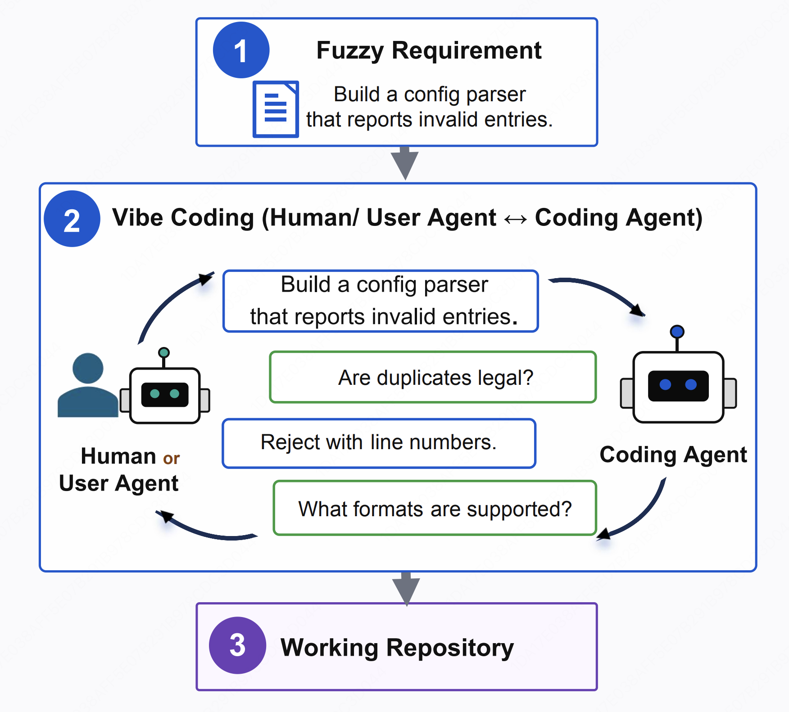

<p align="center">
  
</p>

<h1 align="center">ICAE-Bench</h1>

<p align="center">
  An interactive benchmark for evaluating coding agents under incomplete requirements.
</p>

<p align="center">
  <a href="">
    
  </a>
  <a href="">
    
  </a>
  
  
</p>

## 🔥 What's News

- **July 2026** — Released ICAE-Bench with 480 anonymized tasks, 12 programming languages, an interactive Oracle, and a four-part evaluation pipeline.

## 💡 Introduction

ICAE-Bench gives a coding agent a deliberately fuzzy Product Requirement Document (PRD). The agent must clarify missing requirements with a hidden-spec **User Agent (Oracle)**, implement the project inside a language-specific container, and then face four groups of evaluation.

- **Real-world scope:** 480 anonymized tasks across 12 programming languages.
- **Interactive requirements:** answers come from hidden ground truth rather than improvised model responses.
- **Multiple agent runtimes:** Claude Code by default, with optional OpenHands support.
- **Four-part scoring:** dynamic tests, structural similarity, critic review, and interaction quality.


<p align="center">
  
</p>


## 🚀 Quick Start

Run all commands from the repository root.

### 1. Install and download

```bash
bash setup.sh
```

The setup script:

1. selects an installed Python 3.11 or newer;
2. creates `.venv` and installs the Python dependencies;
3. downloads the language images, golden repositories, and authoritative tests.

It is safe to run again: completed downloads are reused and interrupted downloads resume when possible.

| Option | Purpose |
|---|---|
| `bash setup.sh --skip-download` | Install Python dependencies only |
| `bash setup.sh --openhands` | Also install OpenHands; requires Python 3.12+ |
| `PYTHON=/path/to/python bash setup.sh` | Use a specific Python interpreter |

### 2. Configure the models

Replace the `<...>` placeholders only for the models you plan to use.

| Configuration | Role |
|---|---|
| `model_list.json` → `Tested Model` | Coding agent being evaluated |
| `model_list.json` → `Critic Model` | Reviewer used by agentic scoring |
| `user_agent/user_model.json` | Oracle that answers clarification questions |

Model names passed to the runner are the JSON keys, such as `Opus-4.8`, `GLM-5.1`, or `GPT-5.5`.

#### Claude Code user settings

The default runner loads Claude Code’s user and project settings. Create or merge `~/.claude/settings.json`:

```json
{
  "$schema": "https://json.schemastore.org/claude-code-settings.json",
  "env": {
    "ANTHROPIC_AUTH_TOKEN": "<your-token>",
    "ANTHROPIC_BASE_URL": "<https://your-anthropic-gateway>",
    "ANTHROPIC_DEFAULT_OPUS_MODEL": "<provider-opus-model-id>",
    "ANTHROPIC_DEFAULT_SONNET_MODEL": "<provider-sonnet-model-id>",
    "ANTHROPIC_DEFAULT_HAIKU_MODEL": "<provider-haiku-model-id>",
    "CLAUDE_CODE_DISABLE_NONESSENTIAL_TRAFFIC": "1",
    "CLAUDE_CODE_THINKING_TYPE": "adaptive",
    "CLAUDE_CODE_DISABLE_EXPERIMENTAL_BETAS": "1",
    "CLAUDE_CODE_EXTRA_BODY": "{\"thinking\":{\"type\":\"adaptive\"}}"
  },
  "skipDangerousModePermissionPrompt": true
}
```

`model_list.json` remains the source of the tested endpoint for each experiment. Its model ID, base URL, and token are injected into the runner process; the user settings above provide machine-wide Claude Code defaults and behavior.

`CLAUDE_CODE_THINKING_TYPE` is gateway/version specific and may be removed when the deployment does not use it. `skipDangerousModePermissionPrompt` belongs in the user settings file, not a project settings file.

> This configuration enables unattended permission bypass. Use it only on a dedicated benchmark machine or in a properly isolated environment. Never commit real credentials.

```bash
chmod 600 ~/.claude/settings.json
```

### 3. Run

```bash
./run.sh
```

The default command performs a one-repository smoke test with `Opus-4.8`. It uses `.venv`, starts the local Oracle when needed, waits for all three Oracle ports, runs the evaluation, and stops only the Oracle process it started.

| Goal | Command |
|---|---|
| Smoke test with another model | `./run.sh GLM-5.1` |
| Run all 50 lite tasks | `RUN_LIMIT=50 ./run.sh Opus-4.8` |
| Use an easier PRD set | `./run.sh Opus-4.8 --difficulty easy` |
| Use a different Oracle model | `USER_MODEL_NAME=Gemini-3.1-Flash-Lite ./run.sh Opus-4.8` |
| Use a remote Oracle | `USER_HOST=10.0.0.8 ./run.sh Opus-4.8` |
| Run with OpenHands | `AGENT_FRAMEWORK=openhands ./run.sh GPT-5.5` |

> A 50-task run can make many model calls and take a long time. Start with the default smoke test.

## 🔍 How It Works

1. The harness selects an anonymized task such as `realcode@001`.
2. The coding agent receives a fuzzy PRD and a clean language container.
3. The agent asks the Oracle for missing requirements, up to the configured query budget.
4. The implementation is generated without exposing the real repository or golden source.
5. Host-side evaluators run tests and compare the result with the hidden reference.

The benchmark covers C#, C++, Dart, Go, Java, JavaScript, Kotlin, PHP, Python, Ruby, Rust, and TypeScript.

## 📊 Evaluation

| Group | What is measured |
|---|---|
| Dynamic test execution | Public, hidden/native, and enhanced test pass rates |
| Structural assessment | File count, LOC, class similarity, and method similarity |
| Agentic evaluation | Semantic similarity, API similarity, and design quality |
| Interaction quality | Constraint coverage, fallback rate, and query-budget usage |

Each run writes its generated code, logs, scores, and reproducibility settings under one `append_id`:

```text
results/
├── settings.json
└── <append_id>/
    ├── settings.json
    ├── summary.md
    ├── _logs/
    ├── _eval/
    └── <alias>/
```

The main report is:

```text
results/<append_id>/summary.md
```

Re-score an existing run without regenerating code:

```bash
.venv/bin/python -m harness.orchestrator eval --append-id <append_id>
```

The command reuses the run configuration and generated repository list saved in `results/<append_id>/settings.json`. Add `--repos` or `--limit` to evaluate a smaller subset.

## 🛠️ Advanced Usage

<details>
<summary><strong>Direct harness invocation</strong></summary>

Start the Oracle separately, then run:

```bash
.venv/bin/python -m harness.orchestrator run \
  --model-name Opus-4.8 \
  --eval-mode lite \
  --difficulty normal \
  --agent-framework claude-code \
  --user-model-name DeepSeek-V3.2 \
  --critic-model-name Deepseek-V4-Flash \
  --query-count 16 \
  --concurrency 4 \
  --user-host 127.0.0.1
```

Useful selectors:

| Flag | Meaning |
|---|---|
| `--eval-mode lite` | First 50 tasks |
| `--eval-mode full` | All 480 tasks |
| `--difficulty normal\|medium\|easy` | Select PRD detail level |
| `--repos realcode@001,realcode@002` | Select explicit tasks |
| `--limit N` | Truncate the selected task list |
| `--append-id ID` | Resume an existing run |

</details>

<details>
<summary><strong>Run the Oracle manually</strong></summary>

```bash
.venv/bin/python user_agent/main.py
```

The service listens on three ports in one process:

| Port | Service | Purpose |
|---|---|---|
| `50001` | Init | Mint and register an `append_id` |
| `50002` | Interaction | Answer clarification questions |
| `50003` | Stats | Return interaction-quality metrics |

The Oracle must use a model deployment that respects the caller-supplied `system` prompt. See [`user_agent/README.md`](user_agent/README.md) for its API and behavior.

</details>

<details>
<summary><strong>Download or repair data only</strong></summary>

```bash
bash download_scaffold.sh
```

The script prepares:

| Artifact | Default location |
|---|---|
| 11 language images for 12 languages | `docker_lang_official/` |
| Golden source repositories | `realcode_repos/` |
| Authoritative test repositories | `rcb_tests_repos/` |

JavaScript and TypeScript share the Node.js image. Data directories may be relocated with `ICAE_DOCKER_LANG_DIR`, `ICAE_GOLDEN_REPOS_DIR`, and `ICAE_RCB_TESTS_DIR`.

</details>

<details>
<summary><strong>Lower-level convenience scripts</strong></summary>

These scripts expect the Oracle to be managed separately:

```bash
# One configured model over the 50-task lite set
bash scripts/run_lite_base.sh Opus-4.8

# All configured models compatible with the selected framework
bash scripts/run_all_lite_base.sh
```

The all-model command runs models in parallel and can multiply load on Docker, the Oracle, the Critic, and shared API quotas.

</details>

<details>
<summary><strong>Regenerate fuzzy PRDs</strong></summary>

The generated PRD trees are already included. To rebuild them from the authoritative task JSON:

```bash
.venv/bin/python tools/write_fuzzy_prds.py --difficulty all
```

Use `normal`, `medium`, or `easy` instead of `all` to regenerate one tree.

</details>

## ⚙️ Environment Variables

| Variable | Purpose |
|---|---|
| `PYTHON` | Interpreter used by `setup.sh` |
| `MODEL_NAME` | Default tested-model key used by `run.sh` |
| `RUN_LIMIT` | Repository limit used by `run.sh`; defaults to `1` |
| `CONCURRENCY` | Parallel repository count |
| `AGENT_FRAMEWORK` | `claude-code` or `openhands` |
| `USER_HOST` | Oracle host |
| `USER_MODEL_NAME` | Oracle model key |
| `CRITIC_MODEL_NAME` | Critic model key |
| `ICAE_CLAUDE_CLI` | Custom path to the Claude Code CLI |
| `ICAE_DOCKER_LANG_DIR` | Language-image directory |
| `ICAE_GOLDEN_REPOS_DIR` | Golden-source directory |
| `ICAE_RCB_TESTS_DIR` | Authoritative-test directory |
| `PROXY` | Proxy injected into evaluation containers |
| `PROXY_FALLBACK_FILE` | Shell file providing the one-shot fallback proxy |

## 🗂️ Project Map

| Path | Purpose |
|---|---|
| `harness/` | Generation, container provisioning, evaluation, and reporting |
| `user_agent/` | Oracle service and hidden task specifications |
| `scripts/` | Lower-level experiment launchers |
| `tools/` | PRD generation utilities |
| `fuzzy_prds*/` | Generated fuzzy PRD trees |
| `model_list.json` | Tested-model and Critic endpoints |
| `repo_alias.json` | Anonymous task-to-repository metadata |
| `setup.sh` | Environment and data bootstrap |
| `run.sh` | Recommended experiment entry point |

---

<a id="citation"></a>

## 📖 Citation

If you find **ICAE-Bench** useful for your research, please consider citing our paper:

```bibtex
@article{icae2026,
  title={ICAE-Bench: Evaluating Coding Agents as Interactive Project Builders},
  author={Zhongyuan Peng, Dan Huang, Chuyu Zhang, Caijun Xu, Changyi Xiao, Shibo Hong, David Lo, Lin Qiu, Xuezhi Cao, Jiyuan He, Yixin Cao},
  journal={arXiv preprint arXiv:2607.xxxxx},
  year={2026}
}
```
